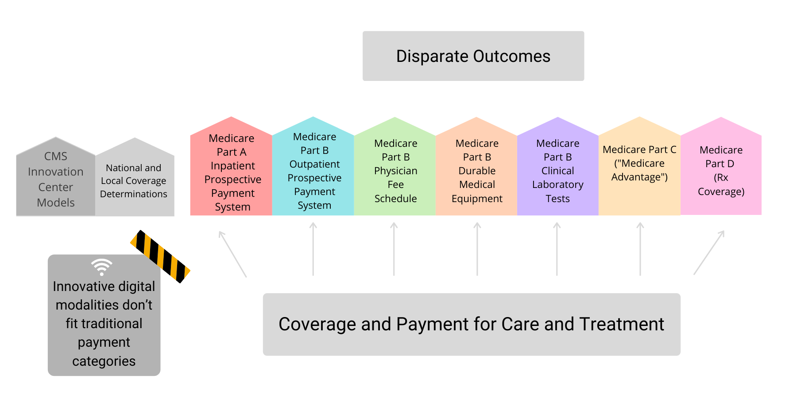

## CMS announced a new rules of deployment for epoch-making Medical Devices

Certer for Medicare & Medicaid Services (CMS)는 지난 8월 (2020년 8월) FDA 승인을 받은 획기적인 의료 기기에 대하여 승인 즉시, 그 당일부터 4년동안 Medicare coverage를 제공하는 새로운 규칙을 발표했다. 

Medicare Coverage of Innovative Technology (MCIT)라고 명명된 이 규칙은 미국 FDA가 "breakthrough"한 것으로 인정한 새로운 의료 기기, 즉 우리나라로 따지면 신의료기술 의료 기기에 대하여 의료 수혜자들이 신속하게 접근하여 해택을 복 수 있는 경로를 제공한 것이다. 

이 규칙에 따르면, 미국 FDA로부터 승인된 "획기적인" 의료 기기는, 승인 당일부터 Medicare 가입 환자들에게 보험 급여가 가능한 항목으로 적용되기 시작한다. CMS는 이 의료 기기들에 대하여 4년 동안의 coverage를 보장하며, 이 기간동안 해당 의료 기기를 생산하는 회사는 이 의료 기기가 환자들의 건강 관리에 유용한 효과 또는 가능성이 있다는 것을 보여주는 증거를 수집하여, 4년 이후 추가 보장이 가능하도록 CMS에 신청해야한다. 

일반적으로 의료 기기들은 FDA의 승인을 받더라도 Medicare로부터 보험 보장을 받기위하여 추가적인 허가 프로세스를 거쳐야한다. 이 프로세스 역시 FDA 승인을 위해 소비되는 정도는 아니지만 많은 비용과 시간을 필요로 한다. 

많은 의료 기기 생산 업체들에게 이 프로세스는 FDA 승인을 위한 기간 만큼이나 고통스럽다. 이들은 이미 FDA 승인을 받기위해 엄청난 시간과 자원을 소비하였기 때문에 비록 Medicare 보장을 위한 자원 투자가 FDA를 위한 것보다 적다고 하더라도 업체들에게는 큰 부담이 아닐 수 없다.

이러 이유로 환자들이 혁신적인 의료 기술에 접근할 수 있는 기회는 점점 줄어들 수 밖에 없다. 최근의 의료 기술은 짧은 시간 내에도 이미 그 파괴력이 무뎌져버리는 경우가 비일비재 할 뿐 아니라 승인과 보장을 위해 투입된 엄청난 양의 시간과 자원은 자연스럽게 소비자에게 높은 가격으로 전가될 수 밖에 없기 때문이다. 

이 제안은 2020 년 9 월 1 일부터 적용되었으며, 이 적용 이후 FDA평가가 끝난 의료 기기 뿐 아니라 2019년부터 사용 승인된 의료 기기들 중 적정 수준 이상의 평가를 받은 의료 기기들에도 적용되어 Medicare의 보장이 가능해진다. 

CMS가 의료 기기 안전 문제 등에 대하여 얼마나 촘촘한 안전 장치 또는 계획을 가지고 있는지에 대해서는 좀 더 살펴볼 필요가 있을 듯 하다. 분명한 것은 이 조치로 인해서 의료 산업 전반에 걸쳐서 R&D에 대한 적극적인 투자가 기대되며, 이 이득이 신속하게 환자들에게 직접 전달될 수 있는 길이 열렸다는 것이다. 

한국정부도 신의료기술, 디지털 의료기술에 대한 진취적인 의료 보험 적용 논의를 고려해야 하지 않을까.

이달 Health Affairs에는 이 CMS의 조치에 대한 Pro & Con, 그리고 impact에 대한 글이 실렸다. 

[Rethinking CMS Coverage And Reimbursement For The Fourth Industrial (AKA Digital) Revolution](https://www.healthaffairs.org/do/10.1377/hblog20201021.783035/full/)
