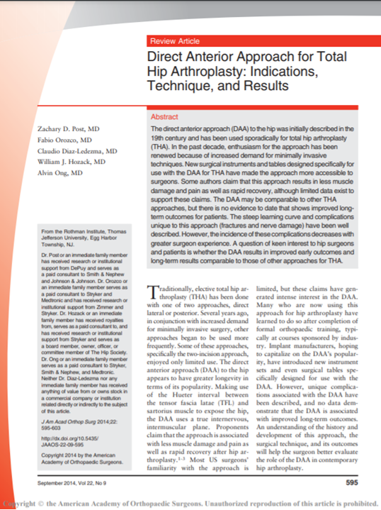

Surgery done by **Dr. William Hozack** of Rothman Orthopaedic Institute at **Hip Symposium Bern 2018**

Click the Image

@ This vides cannot be played directly on this blog because it is an age-restricted video.

Post ZD, Orozco F, Diaz-Ledezma C, Hozack WJ, Ong A. **Direct anterior approach for total hip arthroplasty: indications, technique, and results.** J Am Acad Orthop Surg. 2014 Sep;22(9):595-603. doi: 10.5435/JAAOS-22-09-595. PMID: 25157041.
[PubMed Link](https://pubmed.ncbi.nlm.nih.gov/25157041/)