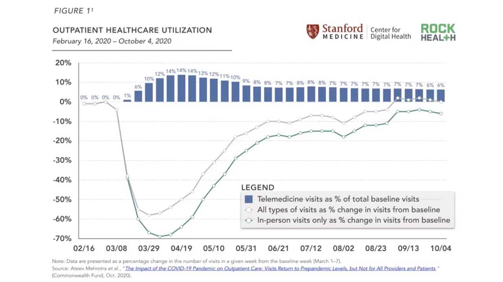

미국 스타트업에 대한 투자가 역대 최고 치를 갱신하고 있다. 주가의 고공 행진과 더불어 많은 스타트업들이 IPO를 단행하였고 (성공과 실패는 별개의 이야기로...) 연방정부는 연일 돈을 찍어내는데 여념이 없다. 아직 적절한 투자처를 찾지 못한 펀드가 어마어마하다는 업계의 풍문을 고려한다면, 시장에 대한 여러 우려가 있음에도 이런 고공 행진은 당분간 지속될 듯하다. 

이런 벤처 업계에서 가장 큰 화두는 Healthcare이다. 2020년에만 141억 달러가 디지털 헬스케어에 초점을 맞춘 스타트업 또는 이와 관련한 벤처 펀드에 투자되었다. 이는 지난 몇 년간 디지털 헬스케어 회사의 투자 총액을 훨씬 능가하는 규모이고, 이전 최고 기록인 2018년 82억 달러 투자 규모를 훨씬 상회하는 규모이다(1). 또한 놀라운 것은 각각 업체에 투자된 거래 규모인데, 2020년 스타트업 당 평균 투자 거래 규모는 3190만달러 수준을 기록했다.

이 모든 것이 의미하는 바는 무엇일까?

거품? 새로운 기회? 패러다임의 전환?

누구도 이 디지털 헬스케어 열풍에 COVID-19로 인한 과장된 흥분이 없다고 말할 수는 없을 것이다. 대다수의 사람들은 COVID-19이 지나간 후에도 이 성장 기세의 상당 부분이 시장에 남아 있을 것이라고 생각하고 있다. 

현재 우리에게 제시된 여러 디지털 헬스케어 솔루션들이 우리가 가지게 될 전부일 것이라는 섣부른 생각이, COVID-19 이후에 이 열병이 사그라질 것이라는 착각을 불러올 수도 있다. 

하지만 우리가 이 시점에서 헬스케어 시장의 폭발과 디지털 플랫폼으로의 전환, 투자 시장의 폭발이라는 현상에서 놓치지 말아야 하는 것은 치료 패러다임의 변화가 일어나고 있다는 사실이다.

-----------------------------------

현재 미국 보건계의 화두는 나날이 증가하는 보건 의료 비용을 어떻게 낮출 것이며, 이와 동시에 어떻게 하면 보편적인 의료 접근이 가능하도록 할 것인가이다.

특히 COVID-19를 겪으면서 넓은 의미의 지역사회 보건을 다루는 social determinant of health, 즉 보건에 대한 사회 결정 요인을 어떻게 다루고, 이를 통해 population health를 향상시킬 것인가가 혁신적인 치료보다 더 중요하다는 목소리가 점점 높아지고 있다.
임상치료가 중요한 것은 물론 사실이지만 특히 이번 팬데믹 상태에서 유행병이 의료 서비스의 불평등 심화할 수 있다는 사실을 드러낸 상황에서 이런 상황을 악화시키는 사회적 결정 요인들을 다루는 것이 훨씬 더 중요하다는 것을 그 어느 때보다 깨닫고 있다. Robert Wood Johnson Foundation의 분석을 보면 사회 결정 요인들이 건강 결과의 ~ 40 %에 기여한 반면 임상 치료는 ~ 15 %에만 기여하고 있는 것으로 추정하고 있다 (2).

따라서 의료 서비스의 파괴적인 변화를 희망하려면 의료 서비스를 제공하는 방식에 변화가 필요하다는 것이 미국 보건 관계자들의 공통된 생각이며, 현재 미국의 디지털 헬스케어 스타트업들이 추구하는 트렌드가 이런 시대의 변화 안에서 새로운 **Need**를 찾아 새로운 서비스를 제공하는 것이다.  

의료서비스 패러다임의 변화는 팬데믹 이전부터 서서히 그 필요성이 대두되어 왔다. 하지만 COVID-19는 실제로 이러한 전환을 극도로 강요했다. 이제는 많은 의료서비스 제공자들이 생존을 위해서 변화해야 하는 현실과 마주하게 된 것이다. 

-------------------------------

팬데믹 이후 어느정도 이전 방식으로의 회귀는 예상해야 할 것이다. 디지털 헬스의 대명사처럼 여겨진 telehealth로의 전환이 예상보다 저조한 현실을 보면 더더욱 혁신의 속도가 더딜지 모른다는 예측이 설득력을 얻는다. 

이 상황에서 우리가 생각해봐야 할 것은 디지털 헬스케어로의 전환이 아직 시기상조라는 우려 섞인 예측이 아니다. 오히려 우리가 상상한 그런 형태가 아닌 다른 형태의 디지털 플랫폼이 다음 세대가 원하는 새로운 형태의 디지털 의료 서비스는 아닐지에 대해서 고민해봐야 할 것이다. 
 
------------------------------

한국의 디지털 헬스케어는 이 변화를 따라갈 것인가?

우선 다시 한번 강조하자면, 미국 디지털 헬스의 붐은 단순한 기술의 발전이 아닌 미국 보건 환경의 변화에 기인한 것임을 알아야 한다. 

이런 보건 의료 환경의 변화에 대한 논의가 본격적으로 시작된 것이 2000년대 후반, 즉 지금으로부터 약 10여년 전이다. 그리고 그 사이 2번의 정권 교체가 있었다. 

이런 긴 논의에도 그 변화는 충분히 급진적으로 느껴진다. 

이런 것을 생각한다면 한국의 변화는 5년뒤 10년 뒤를 기대할 수 있을까?

가장 우려되는 것은 혹시나 이런 변화가 stakeholder들은 눈치채지 못하는 사이 공무원들의 서류 속에서 시나브로 이루어지는 것이다. 
